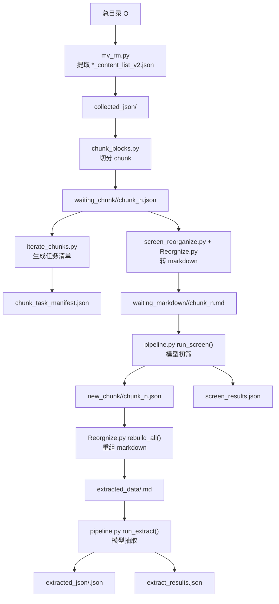

# MinerFlow

## 流水线说明

本仓库用于处理一批 `*_content_list_v2.json` 文件，流水线分为以下阶段：

1. 从总目录 `O` 下的各个子目录中收集目标 JSON
2. 将 JSON 按内容块切分为多个 chunk
3. 为 chunk 生成任务清单
4. 将 chunk JSON 转成 markdown
5. 使用本地模型对 chunk 做初筛
6. 将保留的 chunk 按文档重组为 markdown
7. 使用本地模型对重组后的 markdown 做结构化抽取

## 流程图



## 目录说明

使用 `extract.py` 时，默认工作目录结构如下：

```text
extract_workspace/
├── collected_json/
├── waiting_chunk/
├── waiting_markdown/
├── new_chunk/
├── extracted_data/
├── extracted_json/
├── chunk_task_manifest.json
├── screen_results.json
└── extract_results.json
```

各目录和文件含义：

- `collected_json/`：集中收集后的原始 JSON
- `waiting_chunk/`：切分后的 chunk JSON
- `waiting_markdown/`：初筛前的 chunk markdown
- `new_chunk/`：初筛保留的 chunk JSON
- `extracted_data/`：按文档重组后的 markdown
- `extracted_json/`：最终抽取结果
- `chunk_task_manifest.json`：chunk 任务清单
- `screen_results.json`：初筛结果
- `extract_results.json`：抽取结果

## 脚本入口

### `extract.py`

统一入口，支持以下子命令：

- `all`
- `prepare`
- `screen`
- `rebuild`
- `extract`

### `pipeline.py`

流程编排脚本，包含：

- `run_prepare()`
- `run_screen()`
- `run_rebuild()`
- `run_extract()`

### `mv_rm.py`

从总目录中提取 `*_content_list_v2.json` 到集中目录。

### `chunk_blocks.py`

读取原始 JSON，保留内容块并切分为 `chunk_*.json`。

### `iterate_chunks.py`

遍历 `waiting_chunk/`，生成任务清单。

### `screen_reorganize.py`

将 `waiting_chunk/` 中的 chunk JSON 转成 markdown。

### `Reorgnize.py`

负责 chunk markdown 转换、文本清理和重组输出。

### `vllm_service.py`

本地模型加载与调用封装。

## 使用方式

### 1. 仅预演 prepare

```bash
python extract.py prepare /path/to/root_o
```

### 2. 执行 prepare

```bash
python extract.py prepare /path/to/root_o --execute-prepare
```

### 3. 执行 screen

```bash
python extract.py screen \
  --workspace extract_workspace \
  --model-path /path/to/model
```

### 4. 执行 rebuild

```bash
python extract.py rebuild --workspace extract_workspace
```

### 5. 执行 extract

```bash
python extract.py extract \
  --workspace extract_workspace \
  --model-path /path/to/model
```

### 6. 执行完整流程

```bash
python extract.py all /path/to/root_o \
  --workspace extract_workspace \
  --model-path /path/to/model \
  --execute-prepare
```

## 依赖
